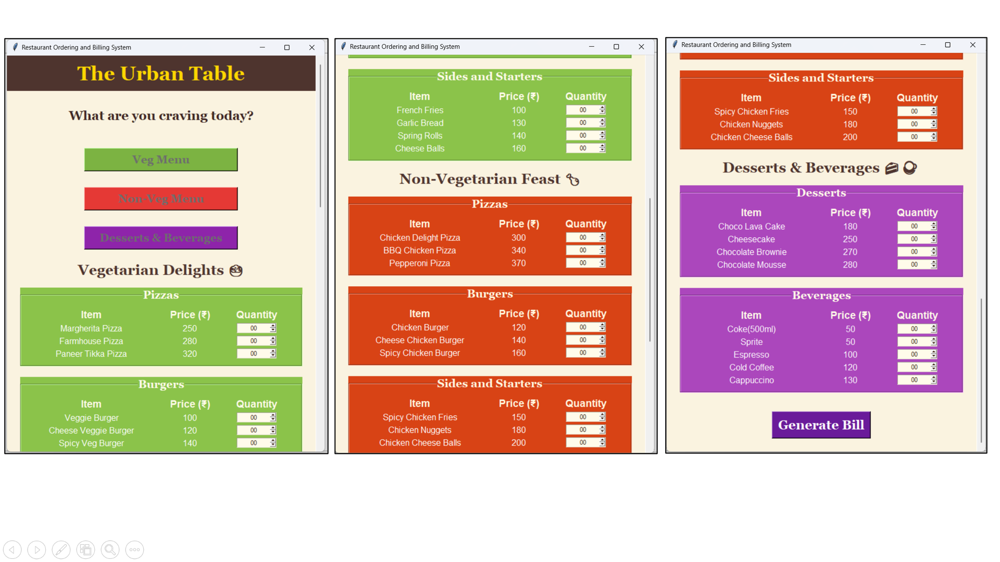
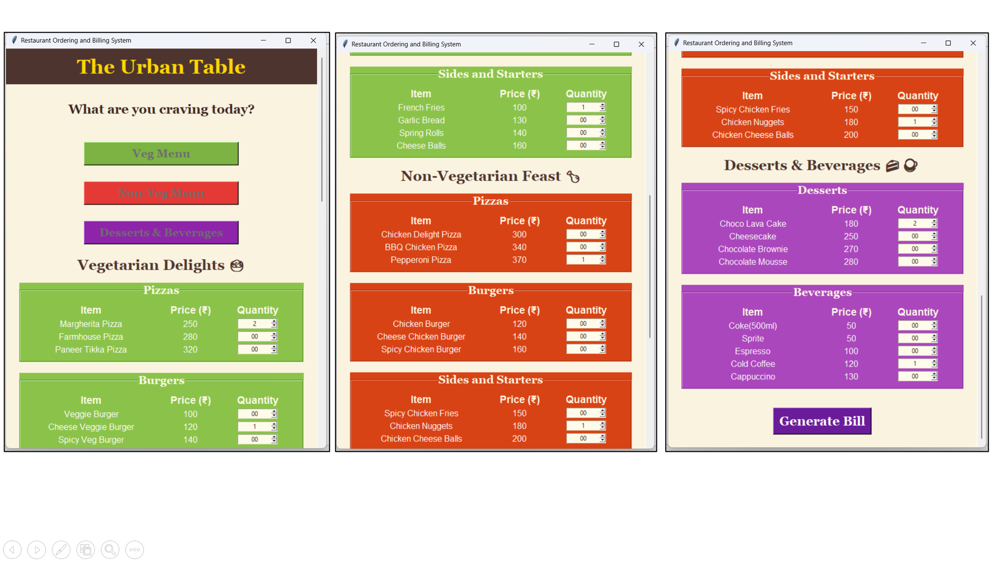
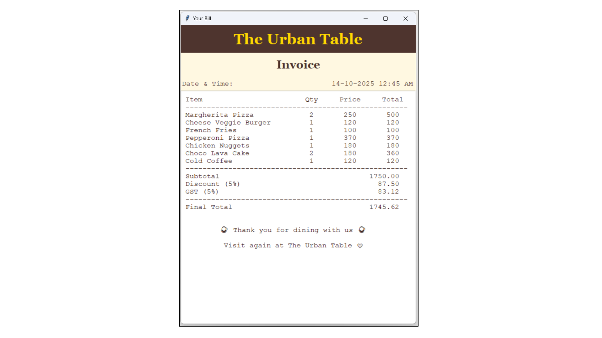

# Restaurant Ordering and Billing System

A GUI-based restaurant ordering and billing application built using Python and Tkinter.  
The system allows users to select menu items, enter quantities, and generate a bill with automatic discount and GST calculation.

## Features

- Simple graphical user interface using Tkinter
- Menu categories: Veg, Non-Veg, Desserts & Beverages
- Quantity selection for each item
- Automatic bill generation
- Discount based on order value
- GST calculation (5%)
- Invoice window showing complete order details

## Technologies Used

- Python
- Tkinter
- ttk widgets
- datetime module

## Screenshots

### Menu Interface


### Order Selection


### Generated Bill


## Project Structure

```
restaurant-billing-system
│
├── project.py
├── menu.png
├── order.png
├── bill.png
└── README.md
```

## Discount Logic

| Order Value | Discount |
|-------------|----------|
| ₹500 – ₹1000 | 2% |
| ₹1001 – ₹2000 | 5% |
| Above ₹2000 | 10% |

## How to Run

1. Install Python 3
2. Download or clone the repository

```
git clone https://github.com/yourusername/restaurant-billing-system.git
```

3. Run the program

```
python project.py
```

## Author

Dipesh Motwani  
Computer Engineering Student  
K J Somaiya Polytechnic, Mumbai
